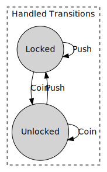

# BBCStateMachine
A simple yet powerful state machine implementation in C#
[](https://github.com/BB-Computerteknikk-AS/BBCStateMachine/actions/workflows/dotnet.yml)

The package is available on NuGet
https://www.nuget.org/packages/BBCStateMachine/ (Core Library)
https://www.nuget.org/packages/BBCStateMachine.GraphCompiler/ (DOT Graph Compiler)

BBCStateMachine lets you describe state machines of any complexity using a fluent interface (whose design relies extensively on method chaining).

## Turnstile State Machine

### Describing the Turnstile State Machine using using fluent syntax

```csharp
enum TurnstileState
{
    Locked,
    Unlocked
}

enum TurnstileInput
{
    Push,
    Coin
}

var stateMachine = new StateMachine<TurnstileState, TurnstileInput>(TurnstileState.Locked);

stateMachine.Builder
    .IfState(TurnstileState.Locked)
    .GotInput(TurnstileInput.Coin)
    .TransitionTo(TurnstileState.Unlocked)
    .Build();

stateMachine.Builder
     .IfState(TurnstileState.Locked)
     .GotInput(TurnstileInput.Push)
     .TransitionTo(TurnstileState.Locked)
     .Build();

stateMachine.Builder
    .IfState(TurnstileState.Unlocked)
    .GotInput(TurnstileInput.Coin)
    .TransitionTo(TurnstileState.Unlocked)
    .Build();

stateMachine.Builder
    .IfState(TurnstileState.Unlocked)
    .GotInput(TurnstileInput.Push)
    .TransitionTo(TurnstileState.Locked)
    .Build();
```
### Getting all possible transitions
```csharp
var possibleTransitions = stateMachine.GetPossibleTransitions(); 
```
### Getting a list of unhandled inputs
```csharp
var unhandledInputs = stateMachine.GetUnhandledInputs(); 
```
### Getting a list of unhandled transitions
```csharp
var unhandledTransitions = stateMachine.GetUnhandledTransitions(); 
```
### Manpipulating the Turnstile State Machine
```csharp
// transition to Unlocked if state is Locked
stateMachine.HandleInput(TurnstileInput.Coin);
// transition to Locked if state is Unlocked
stateMachine.HandleInput(TurnstileInput.Push);
```
### Executing actions when a state is entered
```csharp
 stateMachine.Builder
     .IfState(TurnstileState.Locked)
     .OnEnter((sender, prevState, newState, input) =>
     {
         Console.WriteLine("Entered State Locked");
     })
     .Build();
```
### Executing actions on a specific transition
```csharp
stateMachine.Builder
    .IfState(TurnstileState.Locked)
    .GotInput(TurnstileInput.Coin)
    .TransitionTo(TurnstileState.Unlocked)
    .OnTransition((sender, prevState, newState, input) =>
    {
        Console.WriteLine("Executed on a specific transition");
    })
    .Build();
```
A **DOT graph** like the one below can be compiled using 
```csharp
var graphCompiler = new StateMachineGraphCompiler<TurnstileState, TurnstileInput>(stateMachine);
var graph = graphCompiler.CompileDotGraph();
// results can be visualized here: http://graphviz.it
```


## Printer State Machine
Here's a more advanced example describing a **Printer State Machine** using BBCStateMachine's fluent syntax.
```csharp
public enum PrinterState
{
    Disconnected,
    Disconnecting,
    Connecting,
    WaitingForPrint,
    NotFound,
    PrintingData,
    PaperJammed,
}

public enum PrinterInput
{
    Connect,
    WaitForPrint,
    NotFound,
    Disconnect,
    Disconnected,
    PrintData,
    PaperJammed
}

var PrinterStateMachine = new StateMachine<PrinterState, PrinterInput>(PrinterState.Disconnected);

PrinterStateMachine.Builder
.IfState(PrinterState.Disconnected)
.GotInput(PrinterInput.Connect)
.TransitionTo(PrinterState.Connecting)               
.Build();

PrinterStateMachine.Builder
.IfState(PrinterState.Connecting)
.GotInput(PrinterInput.WaitForPrint)
.TransitionTo(PrinterState.WaitingForPrint)
.Build();

PrinterStateMachine.Builder
.IfState(PrinterState.Connecting)
.GotInput(PrinterInput.NotFound)
.TransitionTo(PrinterState.Disconnected)
.Build();

PrinterStateMachine.Builder
.IfState(PrinterState.WaitingForPrint)
.GotInput(PrinterInput.PrintData)
.TransitionTo(PrinterState.PrintingData)
.Build();

PrinterStateMachine.Builder
.IfState(PrinterState.PrintingData)
.GotInput(PrinterInput.WaitForPrint)
.TransitionTo(PrinterState.WaitingForPrint)
.Build();

PrinterStateMachine.Builder
.IfState(PrinterState.PrintingData)
.GotInput(PrinterInput.PaperJammed)
.TransitionTo(PrinterState.PaperJammed)
.Build();

PrinterStateMachine.Builder
.IfState(PrinterState.PaperJammed)
.GotInput(PrinterInput.Disconnect)
.TransitionTo(PrinterState.Disconnecting)
.Build();

PrinterStateMachine.Builder
.IfState(PrinterState.PaperJammed)
.GotInput(PrinterInput.Connect)
.TransitionTo(PrinterState.Connecting)
.Build();

PrinterStateMachine.Builder
.IfState(PrinterState.PaperJammed)
.GotInput(PrinterInput.PrintData)
.TransitionTo(PrinterState.PrintingData)
.Build();

PrinterStateMachine.Builder
.IfState(PrinterState.WaitingForPrint)
.GotInput(PrinterInput.Disconnect)
.TransitionTo(PrinterState.Disconnecting)
.Build();

PrinterStateMachine.Builder
.IfState(PrinterState.PrintingData)
.GotInput(PrinterInput.Disconnect)
.TransitionTo(PrinterState.Disconnecting)
.Build();

PrinterStateMachine.Builder
.IfState(PrinterState.Disconnecting)
.GotInput(PrinterInput.Disconnected)
.TransitionTo(PrinterState.Disconnected)
.OnTransition((sender, prevState, newState, input) =>
{
// execute an action on this transition
})
.Build();
```

## Printer State Machine - DOT Graph


