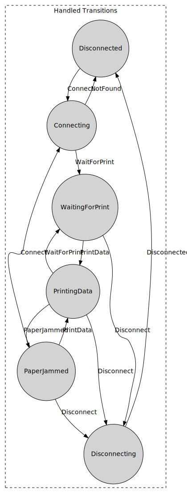

# BBCStateMachine
A simple yet powerful state machine implementation in C#

[](https://github.com/BB-Computerteknikk-AS/BBCStateMachine/actions/workflows/dotnet.yml)

BBCStateMachine lets you describe state machines of any complexity using a fluent interface (whose design relies extensively on method chaining).

Here's an example of a describing a **Printer State Machine** using BBCStateMachine's fluent syntax.
```csharp
var PrinterStateMachine = new StateMachine<PrinterState, PrinterInput>(PrinterState.Disconnected);

PrinterStateMachine.Builder
.IfState(PrinterState.Disconnected)
.GotInput(PrinterInput.Connect)
.TransitionTo(PrinterState.Connecting)               
.Build();

PrinterStateMachine.Builder
.IfState(PrinterState.Connecting)
.GotInput(PrinterInput.WaitForPrint)
.TransitionTo(PrinterState.WaitingForPrint)
.Build();

PrinterStateMachine.Builder
.IfState(PrinterState.Connecting)
.GotInput(PrinterInput.NotFound)
.TransitionTo(PrinterState.Disconnected)
.Build();

PrinterStateMachine.Builder
.IfState(PrinterState.WaitingForPrint)
.GotInput(PrinterInput.PrintData)
.TransitionTo(PrinterState.PrintingData)
.Build();

PrinterStateMachine.Builder
.IfState(PrinterState.PrintingData)
.GotInput(PrinterInput.WaitForPrint)
.TransitionTo(PrinterState.WaitingForPrint)
.Build();

PrinterStateMachine.Builder
.IfState(PrinterState.PrintingData)
.GotInput(PrinterInput.PaperJammed)
.TransitionTo(PrinterState.PaperJammed)
.Build();

PrinterStateMachine.Builder
.IfState(PrinterState.PaperJammed)
.GotInput(PrinterInput.Disconnect)
.TransitionTo(PrinterState.Disconnecting)
.Build();

PrinterStateMachine.Builder
.IfState(PrinterState.PaperJammed)
.GotInput(PrinterInput.Connect)
.TransitionTo(PrinterState.Connecting)
.Build();

PrinterStateMachine.Builder
.IfState(PrinterState.PaperJammed)
.GotInput(PrinterInput.PrintData)
.TransitionTo(PrinterState.PrintingData)
.Build();

PrinterStateMachine.Builder
.IfState(PrinterState.WaitingForPrint)
.GotInput(PrinterInput.Disconnect)
.TransitionTo(PrinterState.Disconnecting)
.Build();

PrinterStateMachine.Builder
.IfState(PrinterState.PrintingData)
.GotInput(PrinterInput.Disconnect)
.TransitionTo(PrinterState.Disconnecting)
.Build();

PrinterStateMachine.Builder
.IfState(PrinterState.Disconnecting)
.GotInput(PrinterInput.Disconnected)
.TransitionTo(PrinterState.Disconnected)
.OnTransition((sender, prevState, newState, input) =>
{
// execute an action on this transition
})
.Build();
```

A DOT graph like the one below can be compiled using 
```csharp
var graphCompiler = new StateMachineGraphCompiler<PrinterState, PrinterInput>(PrinterStateMachine);
var graph = graphCompiler.CompileDotGraph();
// results can be visualized here: http://graphviz.it
```


